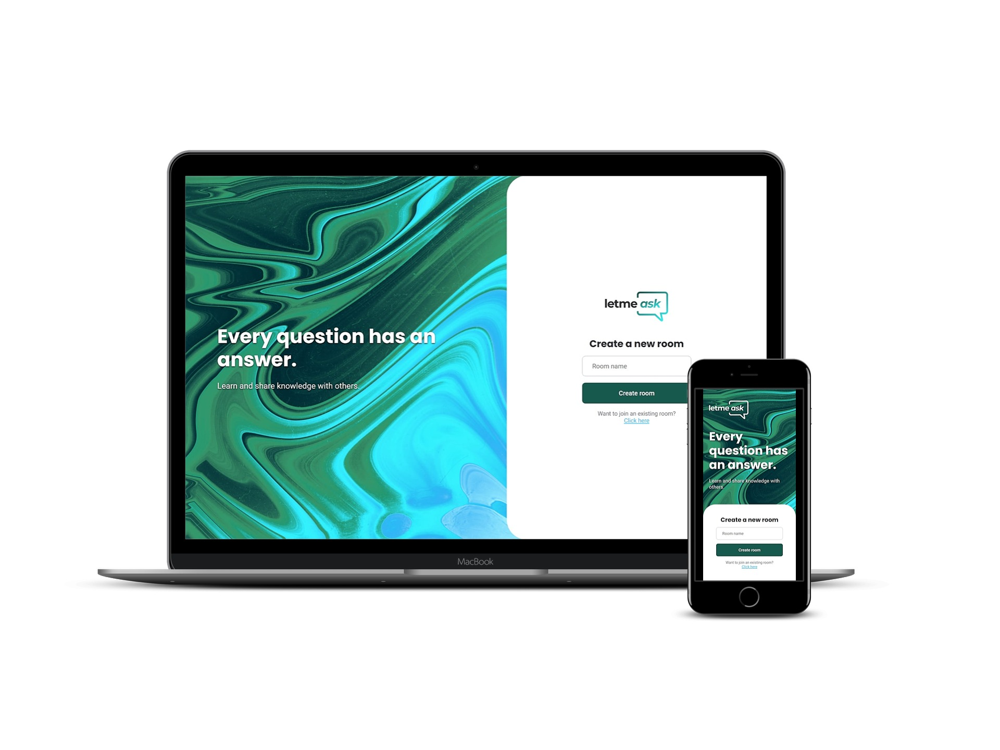

  
   

  
  

  Projeto de App web de gerenciamento de perguntas utilizando React e a plataforma Firebase
   
  (Desenvolvido durante a Next Level Week Together da Rocketseat)

 

  

## Tecnologias e Ferramentas
- React
- Typescript
- Firebase
- Sass

## Versioning/Versionamento
Esse projeto não possui um sistema de versionamento.

## License/Licença do Projeto
[MIT License](https://github.com/LeoRangel/letmeask/blob/main/LICENSE)

