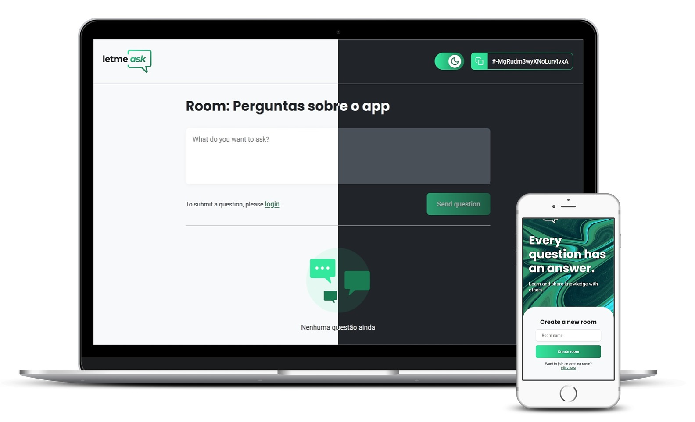

# Letmeask

> :speech_balloon: Projeto de App web de gerenciamento de perguntas utilizando React e a plataforma Firebase
>
> (Desenvolvido durante a Next Level Week Together da Rocketseat)
>
> Para ver o projeto em execução acesse a [**DEMO**](https://letmeask-rho.vercel.app/)

  

## Versioning/Versionamento
Esse projeto não possui um sistema de versionamento.

## License/Licença do Projeto
[MIT License](https://github.com/LeoRangel/letmeask/blob/main/LICENSE)

